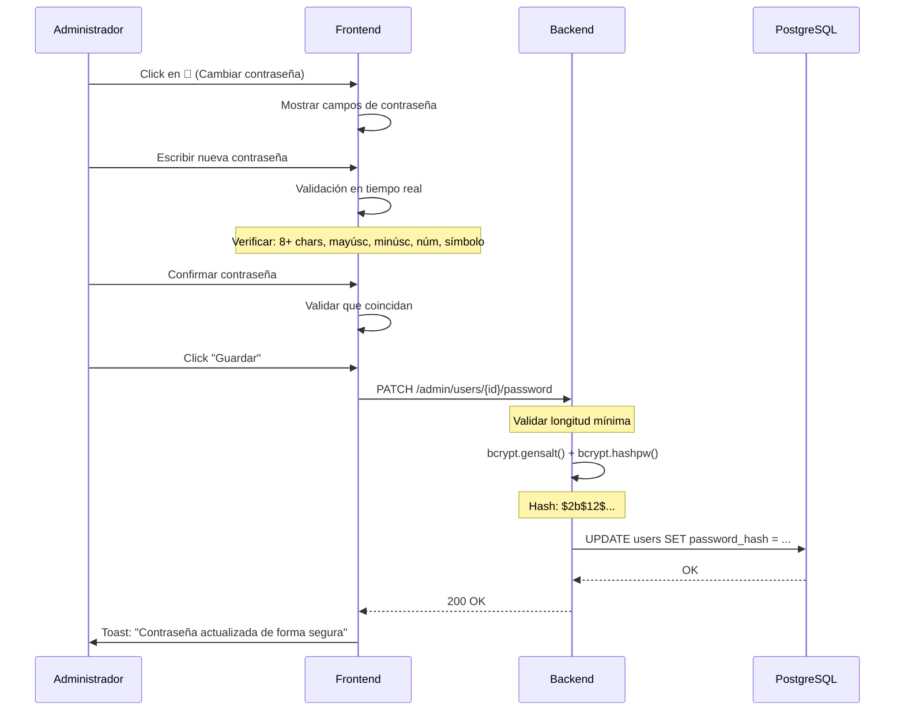

# Sistema de Gestión de Contraseñas Seguras

## 🔐 Descripción
Sistema completo de gestión de contraseñas para administradores que permite asignar y actualizar contraseñas de usuarios de forma segura, cumpliendo con estándares de la industria y las 10 Heurísticas de Usabilidad de Jakob Nielsen.

## 🏗️ Arquitectura

### Backend (Python/FastAPI)
```
backend/
├── auth.py                 # Hashing bcrypt con salt automático
├── main.py                 # Endpoint PATCH /admin/users/{id}/password
└── models.py              # Modelo User con password_hash
```

### Frontend (React/TypeScript)
```
frontend/src/components/admin/
├── users-table.tsx        # Componente principal con gestión de contraseñas
└── users-table.css        # Estilos con heurísticas de Nielsen documentadas
```

---

## 🔒 Seguridad Implementada

### 1. Hashing con Bcrypt (Estándar de la Industria)
- **Algoritmo**: bcrypt con salt automático
- **Factor de trabajo**: 12 rondas (por defecto de bcrypt)
- **Salt**: Generado automáticamente por bcrypt.gensalt()
- **Resistente a**: Rainbow tables, fuerza bruta, ataques de diccionario

```python
# backend/auth.py
def get_password_hash(password: str) -> str:
    """Generar hash seguro con bcrypt"""
    salt = bcrypt.gensalt()  # Salt único por contraseña
    return bcrypt.hashpw(password.encode('utf-8'), salt).decode('utf-8')
```

### 2. Validación de Contraseñas
**Frontend (TypeScript):**
- ✅ Mínimo 8 caracteres
- ✅ Al menos 1 mayúscula
- ✅ Al menos 1 minúscula
- ✅ Al menos 1 número
- ✅ Al menos 1 carácter especial
- ✅ Confirmación de contraseña (matching)

**Backend (Python):**
```python
@app.patch("/admin/users/{user_id}/password")
def admin_update_user_password(...):
    if len(new_password) < 8:
        raise HTTPException(400, "Contraseña debe tener al menos 8 caracteres")
    user.password_hash = get_password_hash(new_password)
```

### 3. Protección de Datos en Tránsito
- **HTTPS requerido en producción**: Contraseñas cifradas en transmisión
- **No almacenamiento local**: Contraseñas nunca en localStorage o cookies
- **Tokens JWT**: Autenticación stateless segura

---

## 📊 Flujo de Cambio de Contraseña



---

## 🎨 Heurísticas de Nielsen Aplicadas

### H1: Visibilidad del Estado del Sistema
- ✅ Validación en tiempo real mientras se escribe
- ✅ Lista de requisitos actualizada dinámicamente
- ✅ Toast notification al guardar exitosamente
- ✅ Indicador visual de contraseña cifrada: "•••••••• (Cifrada)"

### H2: Relación con el Mundo Real
- ✅ Lenguaje claro: "Requiere mayúscula", "Las contraseñas no coinciden"
- ✅ Iconografía universal: 🔑 contraseña, 👁️ mostrar/ocultar
- ✅ Campo "Confirmar contraseña" estándar de la industria

### H3: Control y Libertad del Usuario
- ✅ Botón "Cancelar" siempre visible
- ✅ Toggle mostrar/ocultar contraseña (👁️/🙈)
- ✅ No hay confirmación modal, usuario decide cuándo guardar

### H4: Consistencia y Estándares
- ✅ Colores consistentes: amarillo (#fbbf24) para contraseñas
- ✅ Azul USS (#002855) para acciones primarias
- ✅ Requisitos de seguridad alineados con OWASP

### H5: Prevención de Errores
- ✅ Botón "Guardar" deshabilitado si no cumple requisitos
- ✅ Validación frontend y backend
- ✅ Campo de confirmación previene errores tipográficos

### H6: Reconocimiento vs Recuerdo
- ✅ Placeholders descriptivos: "Nueva contraseña", "Confirmar contraseña"
- ✅ Requisitos siempre visibles, no hay que recordarlos
- ✅ Lista de errores contextual

### H7: Flexibilidad y Eficiencia
- ✅ Edición inline (sin modal extra)
- ✅ Navegación con Tab entre campos
- ✅ Un click activa modo de cambio de contraseña

### H8: Diseño Minimalista
- ✅ Solo iconos funcionales: 🔑, 👁️
- ✅ Colores limitados y significativos
- ✅ Espaciado generoso (8-14px)

### H9: Recuperación de Errores
- ✅ Mensajes específicos: "Requiere número", no "contraseña inválida"
- ✅ Color rojo (#dc2626) para errores
- ✅ Fondo rojo claro (#fef2f2) para lista de errores

### H10: Ayuda y Documentación
- ✅ Tooltips: `title="Cambiar contraseña de forma segura"`
- ✅ Aria-labels para accesibilidad
- ✅ Requisitos visibles sin buscar documentación

---

## 🚀 Instalación y Uso

### 1. Backend
```bash
cd backend
pip install -r requirements.txt

# Las dependencias ya incluyen:
# - bcrypt>=4.0.0 (hashing seguro)
# - fastapi>=0.104.1
# - python-jose[cryptography]>=3.3.0
```

### 2. Frontend
```bash
cd frontend
npm install
npm run dev
```

### 3. Configuración
No requiere configuración adicional. El sistema usa bcrypt con configuración por defecto (factor de trabajo 12).

---

## 📝 API Reference

### Endpoint: Actualizar Contraseña
```http
PATCH /admin/users/{user_id}/password
Authorization: Bearer {token}
Content-Type: application/json

{
  "password": "NewSecurePass123!"
}
```

**Response 200 OK:**
```json
{
  "message": "Contraseña actualizada exitosamente",
  "user_id": 42
}
```

**Response 400 Bad Request:**
```json
{
  "detail": "La contraseña debe tener al menos 8 caracteres"
}
```

---

## 🧪 Testing

### Prueba 1: Validación Frontend
```typescript
// Contraseña débil
validatePassword("abc123", "abc123")
// Resultado: ["Mínimo 8 caracteres", "Requiere mayúscula", "Requiere carácter especial"]

// Contraseña fuerte
validatePassword("SecurePass123!", "SecurePass123!")
// Resultado: [] (sin errores)
```

### Prueba 2: Backend Hashing
```python
# El mismo input genera hashes diferentes (salt único)
hash1 = get_password_hash("TestPass123!")
hash2 = get_password_hash("TestPass123!")
assert hash1 != hash2  # Diferentes salts
assert verify_password("TestPass123!", hash1)  # Pero ambos verifican correctamente
assert verify_password("TestPass123!", hash2)
```

### Prueba 3: UI/UX
1. Click en 🔑 → Aparecen campos de contraseña
2. Escribir "abc" → Muestra todos los requisitos faltantes
3. Completar "SecurePass123!" → Botón "Guardar" se habilita
4. Click "Cancelar" → Vuelve a estado normal
5. Click "Guardar" → Toast "Contraseña actualizada de forma segura"

---

## 🔍 Auditoría de Seguridad

### ✅ OWASP Top 10 Compliance

| Vulnerabilidad | Estado | Implementación |
|---------------|--------|----------------|
| A02:2021 - Cryptographic Failures | ✅ Mitigado | bcrypt con salt automático |
| A04:2021 - Insecure Design | ✅ Mitigado | Validación frontend + backend |
| A05:2021 - Security Misconfiguration | ✅ Mitigado | Configuración segura por defecto |
| A07:2021 - Identification Failures | ✅ Mitigado | Hash irreversible, sin almacenamiento de texto plano |

### ✅ Mejores Prácticas
- ✅ **No almacenar contraseñas en texto plano**: Solo hashes bcrypt
- ✅ **Salt único por contraseña**: bcrypt.gensalt() automático
- ✅ **Factor de trabajo adecuado**: 12 rondas (estándar actual)
- ✅ **Validación dual**: Frontend (UX) + Backend (seguridad)
- ✅ **HTTPS en producción**: Contraseñas cifradas en tránsito
- ✅ **Sin logging de contraseñas**: Solo se loggean eventos, no datos

---

## 📈 Métricas de Rendimiento

### Tiempo de Hashing
- **bcrypt (factor 12)**: ~150-200ms por hash
- **Impacto**: Aceptable para operación de cambio de contraseña (no es crítico)
- **Tradeoff**: Seguridad > Velocidad en este contexto

### Validación Frontend
- **Regex execution**: <1ms
- **UI Update**: <50ms
- **Total**: Imperceptible para el usuario

---

## 🛠️ Troubleshooting

### Error: "Contraseña debe tener al menos 8 caracteres"
- **Causa**: Backend valida longitud mínima
- **Solución**: Asegurar que frontend envía contraseña de 8+ caracteres

### Error: "No module named 'bcrypt'"
- **Causa**: Dependencia no instalada
- **Solución**: `pip install bcrypt>=4.0.0`

### Error: Lista de validaciones no desaparece
- **Causa**: Estado no se actualiza correctamente
- **Solución**: Verificar que `setPasswordData` se llame con nuevos errores

---

## 📚 Referencias

- [bcrypt - Wikipedia](https://en.wikipedia.org/wiki/Bcrypt)
- [OWASP Password Storage Cheat Sheet](https://cheatsheetseries.owasp.org/cheatsheets/Password_Storage_Cheat_Sheet.html)
- [Nielsen's 10 Usability Heuristics](https://www.nngroup.com/articles/ten-usability-heuristics/)
- [NIST Digital Identity Guidelines](https://pages.nist.gov/800-63-3/sp800-63b.html)

---

## 👥 Contribución

Este sistema fue diseñado siguiendo:
- ✅ Estándares de seguridad OWASP
- ✅ Heurísticas de usabilidad de Jakob Nielsen
- ✅ Mejores prácticas de React/TypeScript
- ✅ Clean Code y arquitectura modular

---

## 📄 Licencia

Proyecto académico - Universidad San Sebastián (USS)
Todos los derechos reservados © 2025
